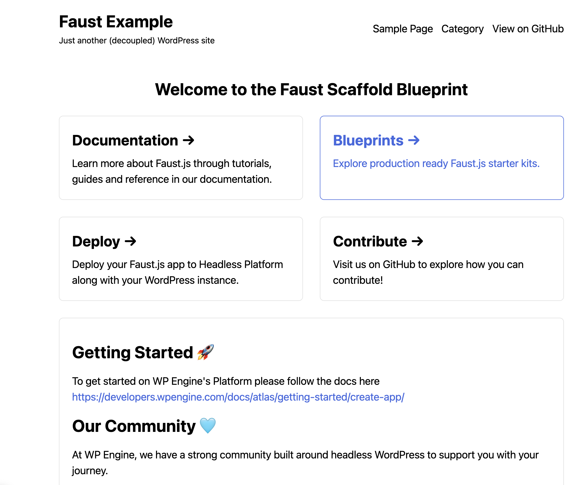
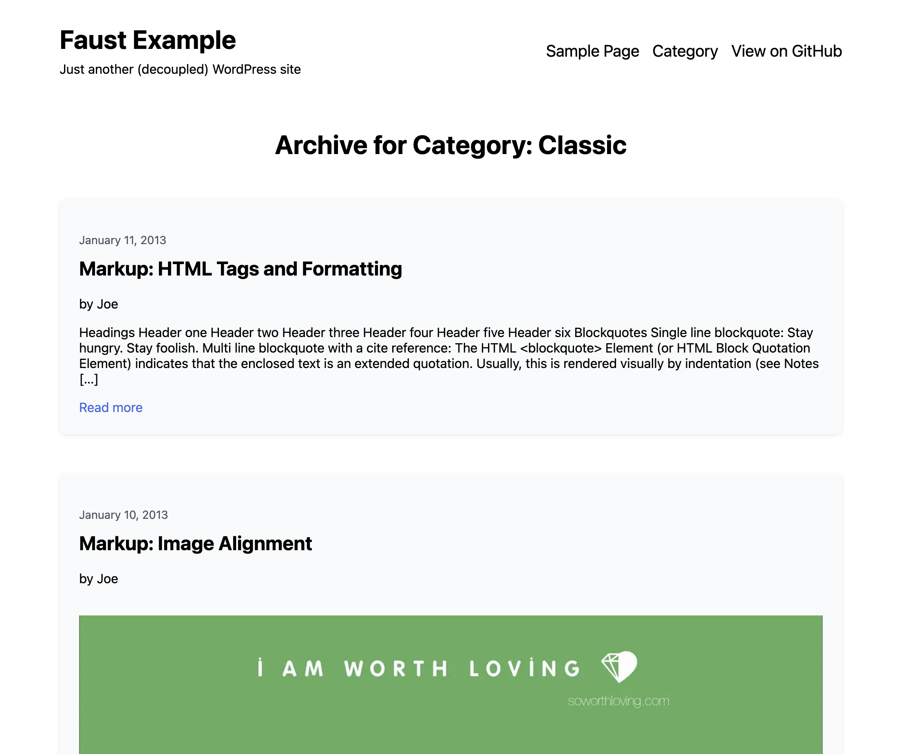
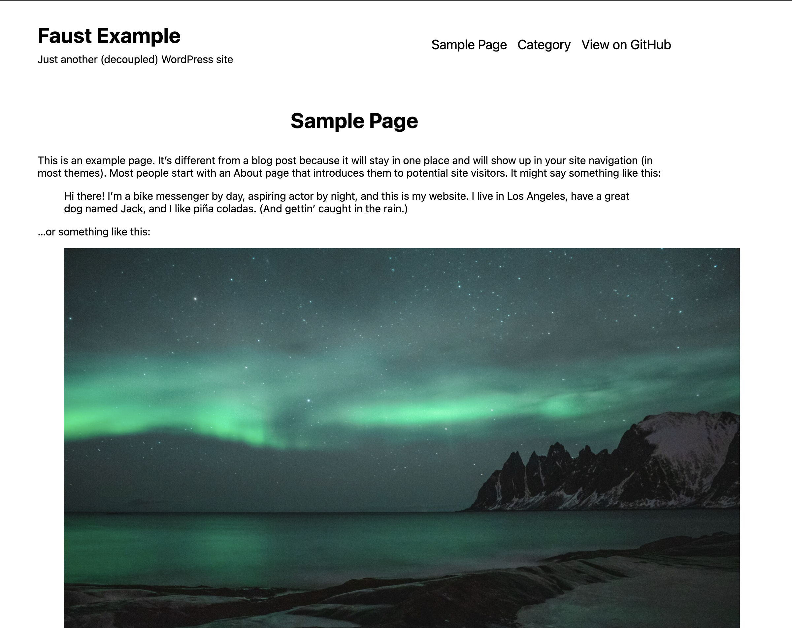
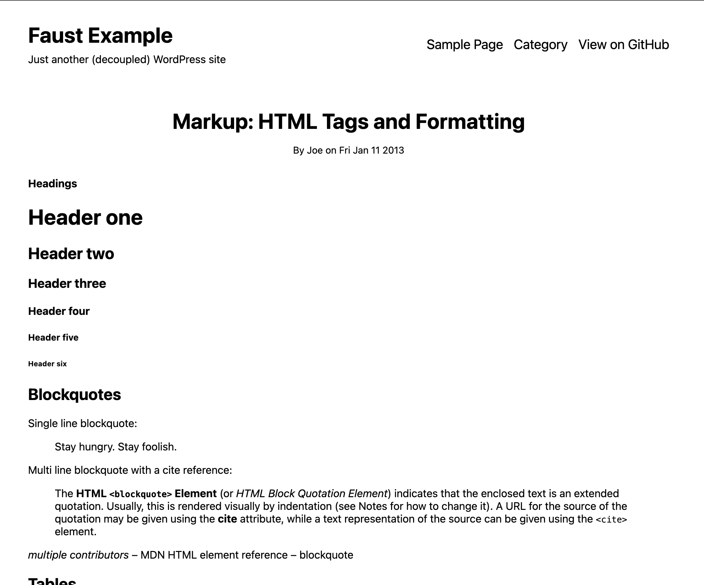

#  Faust.js Starter Kit

This repository contains a starter kit to get you up and running quickly on [WP Engine's Headless Platform](https://wpengine.com/headless-wordpress/) with a WordPress site skeleton for more advanced developers.

## Getting Started 🚀

To get started on WP Engine's Platform please follow the docs here [https://developers.wpengine.com/docs/atlas/getting-started/create-app/](https://developers.wpengine.com/docs/atlas/getting-started/create-app/)

## Project Structure

```bash
├── components/
├── fragments/
├── pages/
├── queries/
├── styles/
├── wp-templates/
│   ├── archive.js          # For your category/archive templates
│   ├── front-page.js       # Front page
│   ├── index.js            # Mapping for available templates
│   ├── page.js             # Single page
│   └── single.js           # Single post or singular
├── DEVELOPMENT.md
├── faust.config.js
├── next.config.js
├── package.json
├── possibleTypes.json
└── README.md
└── screenshots
```

## Available Commands

| Command       | Script                        | Description                      |
| ------------- | ----------------------------- | -------------------------------- |
| `dev`         | `faust dev`                   | Start the development server     |
| `build`       | `faust build`                 | Build the project for production |
| `generate`    | `faust generatePossibleTypes` | Generate GraphQL possible types  |
| `start`       | `faust start`                 | Start the production server      |
| `format`      | `prettier . --write`          | Format code with Prettier        |
| `test:format` | `prettier . --check`          | Check code formatting            |

## Screenshots

<details>
    <summary>View Screenshots</summary>









</details>

## Our Community 🩵

At WP Engine, we have a strong community built around headless WordPress to support you with your journey.

- [Discord Headless Community Channel](https://faustjs.org/discord)
- [Fortnightly Headless Community Call](https://discord.gg/headless-wordpress-836253505944813629?event=1371472220592930857)
- [WP Engine's Headless Platform developer community](https://wpengine.com/builders/headless)
- [WP Engine`s Builders YouTube Channel](https://www.youtube.com/@WPEngineBuilders)
- [WP Engine's Headless Platform](https://wpengine.com/headless-wordpress/)
- [WP Engines Headless Platform Docs](https://developers.wpengine.com/docs/atlas/overview/)

## Plugin Ecosystem 🪄

- [Faust.js](https://faustjs.org)
- [WPGraphQL](https://www.wpgraphql.com)
- [WPGraphQL Content Blocks](https://github.com/wpengine/wp-graphql-content-blocks)
- [WPGraphQL IDE](https://github.com/wp-graphql/wpgraphql-ide)
- [HWP Toolkit](https://github.com/wpengine/hwptoolkit)

## Documentation 🔎

> [!NOTE]
> We are continuously adding new docs for [Faustjs.org](https://faustjs.org/docs)

- [Faust.js Documentation](https://faustjs.org/docs/)
- [Headless Platform Documentation](https://wpengine.com/headless-wordpress/)
- [WPGraphQL Documentation](https://developers.wpengine.com/docs/atlas/overview/)


## Contributions

## Contributor License Agreement

All external contributors to WP Engine products must have a signed Contributor License Agreement (CLA) in place before the contribution may be accepted into any WP Engine codebase.

1. [Submit your name and email](https://wpeng.in/cla/)
2. 📝 Sign the CLA emailed to you
3. 📥 Receive copy of signed CLA

❤️ Thank you for helping us fulfill our legal obligations in order to continue empowering builders through headless WordPress.
